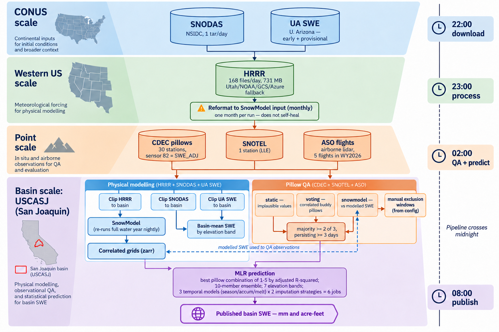

# Pipeline — daily basin SWE prediction

Ingest, processing, QA and prediction for the Snow-Ops MLR system. This describes the
pipeline **as it actually runs**, not as intended; where the two differ it says so.

Worked example throughout: **USCASJ** (San Joaquin), WY2026.

Datasets enter at continental, regional and point scale and converge on one basin. Two
paths run in parallel — physical modelling (blue) and observational QA (orange) — and meet
at the MLR prediction. The dashed arrow is the one loop in the system: modelled SWE is used
to quality-control the pillow observations that the model itself depends on. Cron stages
run down the right-hand rail.

---

## 1. Scale funnel

Data enters at three scales and converges on one basin.

| Scale | Dataset | Source | Volume |
|---|---|---|---|
| **CONUS** | SNODAS | NSIDC `noaadata.apps.nsidc.org` | 1 tar/day |
| **CONUS** | UA SWE | U. Arizona, `early` + `provisional` | 1 nc/day/level |
| **WUS** | HRRR | Utah pando → NOAA S3 → GCS → Azure (fallback chain) | **168 files/day, ~731 MB** |
| **Point** | CDEC pillows | CDEC API, sensor 82 (`SWE_ADJ`) / 3 (`SWE`) | 30 stations |
| **Point** | SNOTEL | `metloom`, LLE via bespoke polygon | 1 station |
| **Basin** | ASO flights | GeoTIFF, irregular | 5 flights in WY2026 |

Everything above is clipped or interpolated to the basin, then reduced to **7 elevation
bands** and one daily basin-mean SWE prediction.

---

## 2. Nightly chain

Four cron jobs. The chain spans midnight: stages 1–2 run on day N, stages 3–4 on day N+1.

### 22:00 — `daily_all/download_daily_conus.sh`

| Step | Writes |
|---|---|
| HRRR download (todo-driven) | `data/met/WUS/hrrr/raw/YYYY/hrrr.YYYYMMDD/` |
| HRRR → SnowModel format | `data/met/WUS/hrrr/F06/3_hrly/year/YYYY/month/MM/` (10 vars) |
| SNODAS CONUS | `data/snodas/CONUS/nc_conus_files/wy_YYYY/` |
| UA SWE CONUS ×2 levels | `data/uaswe/CONUS/[provisional/]wy_YYYY/` |

### 23:00 — `domain_process/process_data_domains.sh`

| Step | Writes |
|---|---|
| CDEC + SNOTEL download | `data/insitu/USCASJ/raw/USCASJ_insitu_obs_daily_wy_YYYY.nc` |
| HRRR clip to basin | `data/met/USCASJ/hrrr/3_hrly/.../MM/` (7 vars) |
| `snowmodel.par` `max_iter` ← days since Oct 1 × 8 + 7 | — |
| **`sbatch` SnowModel** (async) | `snowmodel/domains/USCASJ/outputs/.../wy_YYYY/netcdf/sm_swed_*.nc` |
| └ then `gdat_to_xr` → `snowmodel_basin_process.py` | **`hrrr_correlated_test_YYYY.zarr`**, `mean_swe_snowmodel_*.csv` |
| UA SWE clip ×2 | `data/uaswe/USCASJ/wy_YYYY/`, `mean_swe_uaswe_*.csv` |
| SNODAS clip | `data/snodas/USCASJ/wy_YYYY/`, `mean_swe_snodas_*.csv` |

SnowModel **re-simulates the entire water year on every run** — `max_iter` grows daily.

### 02:00 — `domain_process/insitu_qa_domain.sh`

Pillow QA, then six prediction jobs. Detail in §3 and §4.

### 08:00 — `public/copy_generate_html.sh`

CSV → parquet into `data/basins/USCASJ/`, then `generateHTML{Pred,QA,SWE}.js` → `public/*.html`.

---

## 3. Pillow QA — `scripts/insitu_qa.py`

Each pillow-day is judged by three independent automated methods plus a manual mask.

**Manual exclusion** (`exclude_pillows_ranges` in the region config) is applied **first**, and
masked pillows are dropped from the buddy pools — so an excluded pillow cannot inform
another pillow's QA. WY2026 carried 19 windows for USCASJ, 11 of them full-season.

**Three automated methods**, run per pillow per day by `run_pillow_qa()`:

| Method | Module | Basis |
|---|---|---|
| `static` | `qa_static.py` | physically implausible values and jumps — engineering buffer 1.5, SE buffer 1.2, melt gate 50 mm |
| `voting` | `qa_voting.py` | buddy comparison against historically correlated pillows (`build_corr_rank`, r², `min_overlap=200`, delta-based) |
| `snowmodel` | `qa_snowmodel.py` | comparison against SnowModel `swed` at the correlated grid cells (best / 2nd / 3rd) |

Correlation ranks come from the **historic** record (`pillow_wy_1980_2025_qa1.nc`), so they are
independent of the year being QA'd.

**Combination.** `build_majority_qa_ds()` masks a value when **≥2 of 3** methods flag it **and
the majority persists ≥3 consecutive days** (`persistence_days=3`).

**Outputs:** `processed/*_insitu_obs_daily_wy_YYYY.nc` (the masked dataset MLR consumes),
`qa/insitu_qa_{simple,detail}_wy_YYYY.csv`, and per-pillow diagnostic PNGs under
`qa/qa_viz_YYYY/` and `qa/qa_method_diagnostics_YYYY/`. An example of pillow QA results for all pillows in the San Joaquin for WY2026 is provided in `../pngs/all_pils_qa_USCASJ_wy2026.png`.

Setting `manual_qa_only: True` applies only the manual mask to the saved dataset; the
automated methods still run so the diagnostics remain comparable.

---

## 4. MLR prediction — `scripts/mlr_prediction.py`, `scripts/lm_model.py`

**Training.** Historic pillows (WY1980–2025) paired with ASO flight observations
(35 flights, 2017–2025) per elevation band.

**Pillow selection.** `identify_best_stations()` scores **every combination of candidate
pillows taken 1 through 5** against the ASO record and keeps the argmax by adjusted R².
With `N_ENSEMBLE=10` the next-best combinations are also predicted, giving a spread per
(day, imputation mode, elevation band) rather than a point value.

**Six jobs per night** — three temporal models × two imputation strategies:

| `isSplit` | `isAccum` | Model | | Imputation | Output dir |
|---|---|---|---|---|---|
| 0 | 0 | `season` | | pillow-based | `COMMON_MASK/` |
| 1 | 1 | `accum` (accumulation) | | SnowModel-grid | `SNOWMODEL_IMPUTE/` |
| 1 | 0 | `melt` | | | |

Imputation fills pillows missing on a given day — either from other pillows, or from the
SnowModel grid cells correlated to that pillow. Both are run so the two can be compared.

**Outputs** per variant, under `data/mlr_prediction/USCASJ/models/<variant>/<model>/`:
`prediction_{mm,acreFt,pillows}_wy_YYYY.csv` and `ensemble_tidy_wy_YYYY.csv`.

Measured critical path: **~92 min** at `N_ENSEMBLE=10` (81 min at 1).

---

